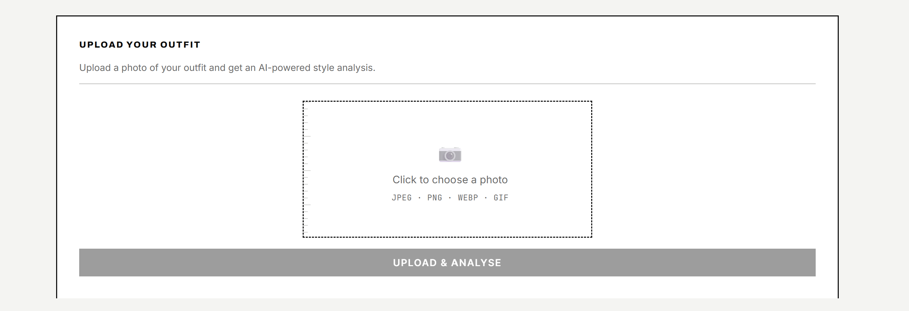
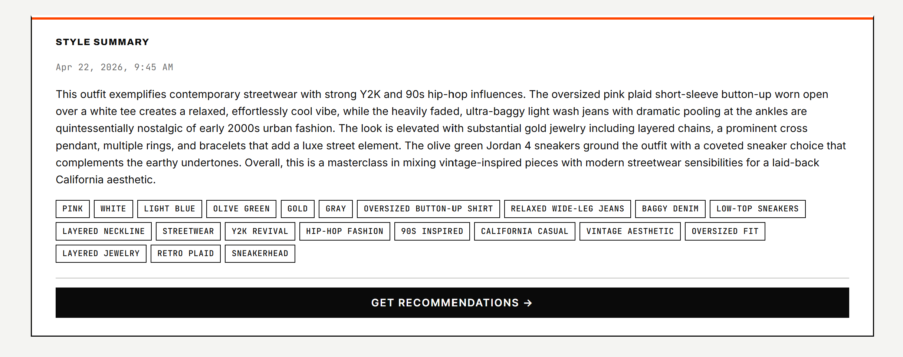
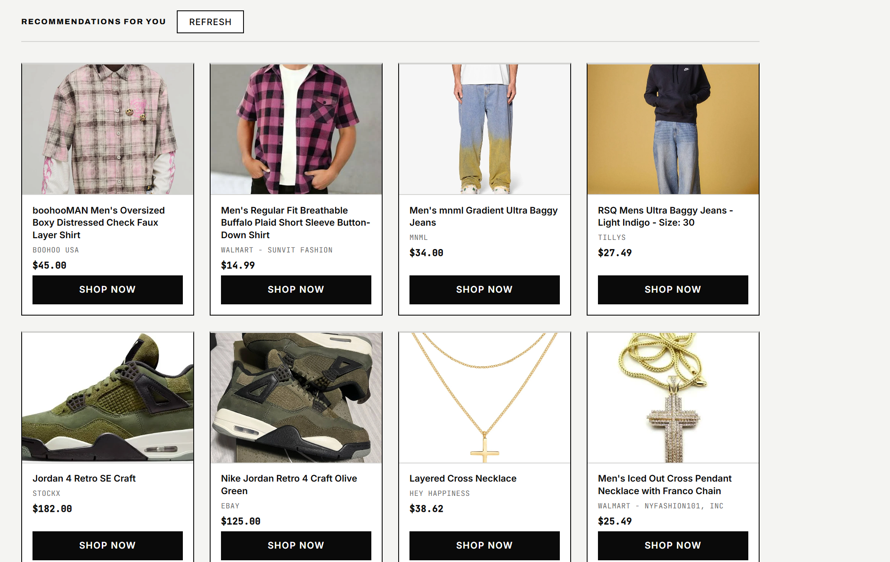

# No Stylist — AI-powered personal style assistant

A full-stack web app that analyses your wardrobe and outfit photos with AI to deliver personalised style recommendations, outfit building, and shoppable product suggestions.

**Live demo:** https://no-stylist.vercel.app
> The backend runs on Render's free tier — expect a ~30 s cold-start on first load.

---

## Screenshots

| Upload | Analyse | Shop |
|--------|---------|------|
|  |  |  |

---

## Features

- AI vision analysis of outfit photos (colors, silhouettes, style tags, written summary)
- Persistent style history with per-analysis deletion
- Dynamic AI-powered product recommendations with caching
- User profiles (gender, age, sizes, preferred styles, brands, occasions, budget) that feed both analysis and recommendations
- Bulk wardrobe upload with AI auto-tagging (category, colors, style tags, description)
- Derive a style profile directly from wardrobe contents
- Outfit builder: pick an anchor item, AI builds around it with wardrobe pieces + shoppable missing gaps
- Generate a look from occasion/weather/vibe inputs
- Wardrobe style audit with on-demand gap-filling
- A/B outfit comparison with optional occasion context
- Full auth: signup with password strength meter, login, logout, change password, forgot password with email reset

---

## Tech Stack

| Layer | Technology |
|---|---|
| Frontend | React (CRA), React Router v6 |
| Backend | Python 3.11+, Flask, Flask-CORS, Gunicorn |
| Auth/DB/Storage | Supabase with RLS policies |
| AI | Anthropic Claude (claude-opus-4-5 vision) |
| Product search | RapidAPI Real-Time Product Search (Google Shopping) |
| Frontend hosting | Vercel |
| Backend hosting | Render |
| Testing | pytest (50+ backend tests), Jest (frontend) |

---

## Architecture Highlights

- Row-level security on every user-scoped table — queries are impossible without a valid session
- Per-request Supabase client pattern ensures RLS is applied consistently across all endpoints
- SSRF protection on image-fetch endpoints (allowlist + private-IP blocking)
- Recommendation results are cached per analysis to avoid redundant API calls
- Non-fatal failure handling across AI pipelines — partial results surface rather than erroring the whole request
- Images are compressed client-side before upload to stay within Claude's 5 MB limit

---

## Prerequisites

- Node.js ≥ 18
- Python ≥ 3.11
- [Supabase](https://supabase.com) project with:
  - Auth enabled
  - Two storage buckets: `outfit-photos` and `wardrobe-items` (each with RLS policies)
  - SQL migrations run (see `backend/migrations/`)
- [Anthropic](https://console.anthropic.com) API key
- [RapidAPI](https://rapidapi.com) key with Real-Time Product Search subscribed

---

## Local Setup

### 1. Clone the repo

```bash
git clone <repo-url>
cd 2150-Indiviual-Project
```

### 2. Backend

```bash
cd backend
python3 -m venv venv
source venv/bin/activate        # Windows: venv\Scripts\activate
pip install -r requirements.txt
```

Create `backend/.env`:

```
SUPABASE_URL=...
SUPABASE_ANON_KEY=...
SUPABASE_SERVICE_ROLE_KEY=...
ANTHROPIC_API_KEY=...
RAPIDAPI_KEY=...
```

Run the SQL migrations in your Supabase project (SQL Editor → paste each file from `backend/migrations/` in order).

Start the server:

```bash
flask run                        # http://localhost:5000
```

### 3. Frontend

```bash
cd frontend
npm install
```

Create `frontend/.env`:

```
REACT_APP_BACKEND_URL=http://localhost:5000
REACT_APP_SUPABASE_URL=...
REACT_APP_SUPABASE_ANON_KEY=...
```

Start the dev server:

```bash
npm start                        # http://localhost:3000
```

> Always start the backend before the frontend. The app will load without it, but every API call will fail until the backend is up.

---

## API Endpoints

All authenticated endpoints require `Authorization: Bearer <access_token>`.

| Method | Path | Description | Auth |
|--------|------|-------------|------|
| POST | `/api/auth/signup` | Register a new user | ✗ |
| POST | `/api/auth/login` | Sign in, receive JWT session | ✗ |
| POST | `/api/auth/logout` | Sign out | ✓ |
| POST | `/api/auth/change-password` | Change password | ✓ |
| POST | `/api/upload` | Upload outfit photo to Supabase storage | ✓ |
| POST | `/api/analyze` | AI vision analysis of an outfit photo | ✓ |
| GET | `/api/history` | List all past analyses for the user | ✓ |
| DELETE | `/api/history/<id>` | Delete a specific analysis | ✓ |
| GET | `/api/profile` | Get user style profile | ✓ |
| PUT | `/api/profile` | Update user style profile | ✓ |
| POST | `/api/profile/apply-derived` | Apply wardrobe-derived style to profile | ✓ |
| POST | `/api/recommendations/<analysis_id>` | Generate product recommendations for an analysis | ✓ |
| DELETE | `/api/recommendations/<analysis_id>` | Clear cached recommendations for an analysis | ✓ |
| POST | `/api/wardrobe/upload` | Bulk upload wardrobe items with AI auto-tagging | ✓ |
| GET | `/api/wardrobe` | List wardrobe items | ✓ |
| PATCH | `/api/wardrobe/<id>` | Update a wardrobe item | ✓ |
| DELETE | `/api/wardrobe/<id>` | Delete a wardrobe item | ✓ |
| POST | `/api/wardrobe/derive-style` | Derive style profile from wardrobe contents | ✓ |
| POST | `/api/wardrobe/build-outfit` | Build an outfit around an anchor wardrobe item | ✓ |
| POST | `/api/wardrobe/audit` | AI wardrobe style audit | ✓ |
| POST | `/api/wardrobe/audit/fill-gap` | Get product suggestions for a wardrobe gap | ✓ |
| POST | `/api/looks/generate` | Generate a look from occasion/weather/vibe inputs | ✓ |
| POST | `/api/compare` | A/B outfit comparison with optional occasion context | ✓ |
| GET | `/api/health` | Backend health check | ✗ |

---

## Running Tests

### Backend (pytest)

```bash
cd backend
source venv/bin/activate
pytest tests/ -v
```

### Frontend (Jest)

```bash
cd frontend
npm test
```

---

## Deployment

See [DEPLOYMENT.md](DEPLOYMENT.md) for instructions on deploying to Vercel (frontend) and Render (backend).

---

## Acknowledgments

This project was built using Anthropic's tools:
- **[Claude Code](https://claude.ai/code)** — AI coding assistant used throughout implementation
- **Claude Design** — UI/UX design with direct handoff to Claude Code for implementation
